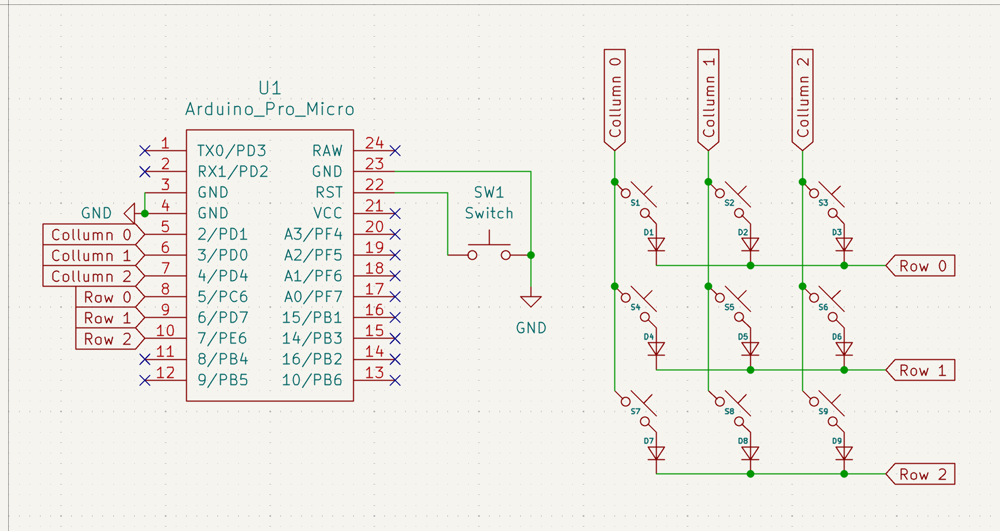
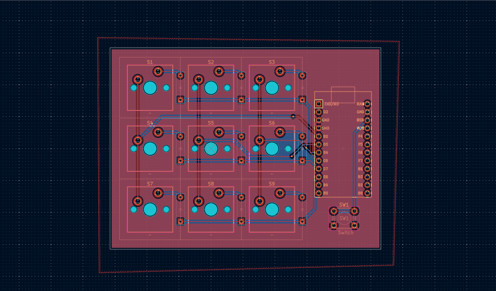
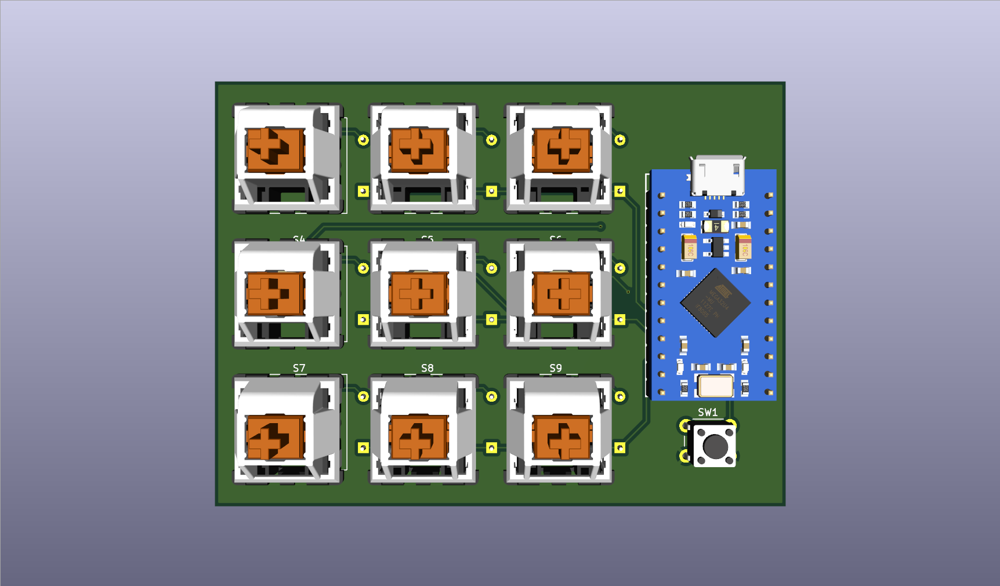
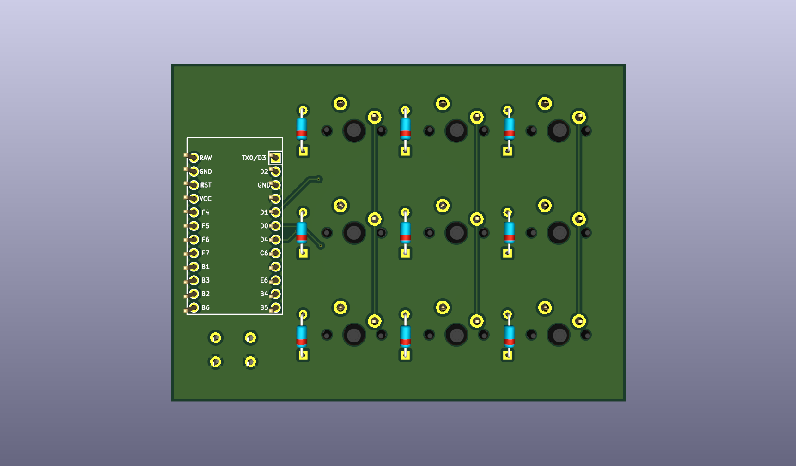

# From Zero to Macropad
This is my first time designing a PCB and 3D modeling using fusion 360.
My goal is to build a macropad with 9 keys, and I will be making it a numpad first. Firmware can always be adjusted to your need.

## Components
- Arduino Micro Pro
- Cherry MX Key Switches
- 3D printed case

## Design
- Quick glance: https://skfb.ly/pGsA6

